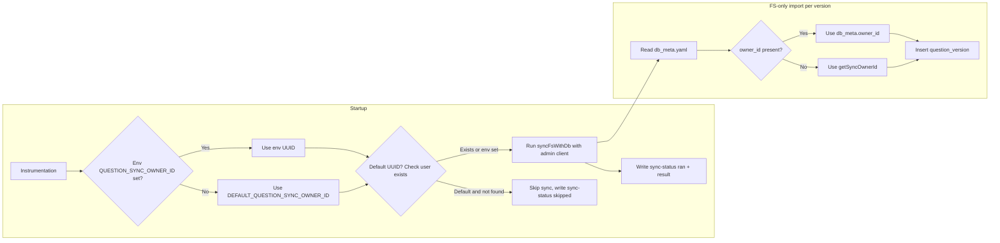

<!--
DOC STRUCTURE RULES
- Exactly one H1 (#) heading at the top
- All other headings must be ## or deeper
- Do NOT hard-code section numbers
- Do NOT put title in YAML header (Quarto uses first H1)
-->
# SPEC: Default question sync owner and system message logging (v0.0.5)

This spec defines two features for the yrS3 tutorial and testing system. It is written so that an implementer (or an LLM in a new chat) can implement it without access to prior discussion. When in doubt, err on the side of clarity and completeness.

---

## Purpose and goals

**Part A — Default question sync owner**

- **User goal:** The system should "work out of the box" without requiring configuration. If there are already question folders on the filesystem (under the questions root) but nothing in the database, the app should import them when the server starts—even before the first user logs in—without the deployer having to set `QUESTION_SYNC_OWNER_ID`.
- **Additional goal:** Sync outcomes (success, skip, or per-version errors) must be **visible in the UI** to all users, not only in server logs. An admin who does not know the system should be able to see that FS sync did not run or that specific imports failed, and get actionable steps to fix it (e.g. run seed, set env vars, see SETUP/SPEC).

**Part B — System message logging**

- **User goal:** Every system message (errors, warnings, info, debug) must be (1) written to a **log file** and (2) **visible in the UI**. No one should have to find or tail log files to see what went wrong or what the system reported. This is especially important during development and for admins who need to diagnose issues.
- **Additional goal:** The UI should support filtering by level (error / warning / info / debug), color coding by level, and hiding/showing details (stack, context, route). Uncaught errors (e.g. in React rendering) must also be captured via Next.js `error.tsx` and reported to both the log file and the UI.

---

## Relevant existing code (do not reimplement)

- **Sync:** `src/lib/questions/sync-questions.ts` — `syncFsWithDb(supabase)` returns `SyncResult` `{ imported: number, conflictsResolved: number, errors: string[] }`. Use this; do not reimplement sync logic.
- **DB meta on FS:** `src/lib/questions/db-meta-fs.ts` — `readDbMeta(root, logicalId, version)` returns `{ owner_id, status, proposed_by } | null`. Use it to read `owner_id` for FS-only import. The file lives at `{QUESTIONS_ROOT}/{logical_id}/{version}/db_meta.yaml`.
- **Admin Supabase client:** `src/lib/supabase/admin.ts` — `createAdminClient()` returns a Supabase client using the **service role key** (env: `SUPABASE_SERVICE_ROLE_KEY` or `SERVICE_ROLE_KEY`). Use this in **instrumentation only**, because startup runs before any request and there are no cookies; the normal server `createClient()` is request-scoped and cannot be used at startup.
- **Instrumentation:** `src/instrumentation.ts` — Next.js calls `register()` once when the server starts. Sync currently runs here only when `QUESTIONS_STORAGE !== 'supabase'`, `QUESTION_SYNC_OWNER_ID` is set, and a service role key exists. After implementation, sync should also run when the **default** sync owner is used (and that user exists in the DB).
- **Sync trigger:** Sync runs **only** at (1) server startup (instrumentation) and (2) when someone calls `POST /api/admin/sync-questions`. It does **not** run on `GET /api/questions` (lazy sync was removed). Do not re-add sync to GET /api/questions.
- **Logger:** `src/lib/logger.ts` — Today logs only to stdout via `console.log`. Part B adds file + UI; optionally call existing `log()` / `logSystem()` from `report()` so stdout logging is preserved.

---

## Environment variables (reference)

| Variable | Part | Required for | Notes |
|----------|------|--------------|--------|
| `QUESTION_SYNC_OWNER_ID` | A | Overriding default | Optional when using seeded default owner. If set, overrides the default UUID. |
| `SUPABASE_SERVICE_ROLE_KEY` or `SERVICE_ROLE_KEY` | A | Startup sync | Required for instrumentation to call Supabase (no user session). Local: from `supabase status -o env`. |
| `QUESTIONS_STORAGE` | A | When to run sync | If set to `"supabase"`, FS sync is not run; leave unset for filesystem storage. |
| `NEXT_PUBLIC_SUPABASE_URL` | A | Admin client + seed | Required for Supabase. |
| `LOG_FILE_PATH` | B | Log file location | Optional; default `logs/app.log` relative to project root. |
| `SYSTEM_MESSAGE_STORE_SIZE` | B | In-memory store cap | Max messages kept in memory (default 1000). Older messages can be loaded from the log file 100 at a time. |
| `SYSTEM_MESSAGE_LOAD_OLDER_BATCH` | B | Load older batch size | Number of older messages to fetch per "Load older" request (default 100). |
| `NEXT_PUBLIC_LOGS_REFRESH_INTERVAL_MS` | B | System log UI refresh | Auto-refresh interval for `/logs` in ms (default 4000). |

---

## Part A: Default question sync owner

### A.1 Current behavior (before implementation)

- `QUESTION_SYNC_OWNER_ID` has no default; when unset, startup sync and FS-only imports are skipped.
- FS-only import always uses `QUESTION_SYNC_OWNER_ID`; `db_meta.yaml` is not read for ownership on import.
- `supabase/seed.sql` is empty. `src/instrumentation.ts` and `src/lib/questions/sync-questions.ts` require the env var. No UI shows sync status or sync errors.

### A.2 Design decisions

- Use a **single seeded user** named "default question owner" (not "admin"). The app currently has no concept of an "admin" user or role; the default user's only purpose is to own FS-imported questions when no owner is set. Do not add admin-only checks or an admin role in this spec. If an admin role is added later, this user can be granted it or a separate admin user can be introduced.
- **Default owner ID:** A fixed UUID defined in one place and reused in seed + app (no runtime lookup).
- **FS-only import:** When importing an FS-only version, read `db_meta.yaml`; if it has a non-empty `owner_id`, use it for that version; otherwise use the sync owner (env or default).
- **Hosted Supabase without seed:** When using the default UUID and the env var is not set, verify that a user with that ID exists (e.g. query `auth.users`) before running startup sync. If the user does not exist, do not run sync; record the skip reason in the sync-status store so the UI shows a prominent banner. Do not rely only on server logs.

### A.3 Implementation steps (default sync owner)

#### Step A.3.1 — Define default sync owner constant

- **Create** `src/lib/questions/sync-owner.ts`.
- Export:
  - `DEFAULT_QUESTION_SYNC_OWNER_ID`: a single fixed UUID string (e.g. `'00000000-0000-4000-8000-000000000001'`). This exact value must be reused in the seed file.
  - `getSyncOwnerId(env?: NodeJS.ProcessEnv)`: returns `(env ?? process.env).QUESTION_SYNC_OWNER_ID ?? DEFAULT_QUESTION_SYNC_OWNER_ID` so callers get env override when set.
- Use this module in both instrumentation and sync-questions so the default is defined in one place only.

#### Step A.3.2 — Seed the default question owner in Supabase

- **Edit** `supabase/seed.sql`.
- Use the **exact same UUID** as `DEFAULT_QUESTION_SYNC_OWNER_ID` from the app (import or copy the constant value into the seed so app and seed stay in sync).
- **auth.users:** Enable `pgcrypto`; hash password with `crypt('your-chosen-default-password', gen_salt('bf'))`. Insert one row with: `id` = the default UUID, `instance_id` = `'00000000-0000-0000-0000-000000000000'`, `aud` = `'authenticated'`, `role` = `'authenticated'`, `email` = e.g. `'default-question-owner@system.local'`, `encrypted_password` = result of crypt, `email_confirmed_at` = NOW(), `raw_app_meta_data` = `'{"provider":"email","providers":["email"]}'`, `raw_user_meta_data` = `'{}'`, `created_at` / `updated_at` = NOW().
- **auth.identities:** Insert one row so the user can sign in: `id` = same UUID, `user_id` = same UUID, `provider` = `'email'`, `provider_id` = same UUID, `identity_data` = JSON with `sub` and `email` (e.g. `format('{"sub": "%s", "email": "default-question-owner@system.local"}', v_user_id)::jsonb`), `last_sign_in_at`, `created_at`, `updated_at` = NOW(). Without this row, login will not work in recent Supabase versions.
- Reference: [Supabase seed auth user pattern](https://laros.io/seeding-users-in-supabase-with-a-sql-seed-script).
- Document the default email and default password in SETUP or README for local dev login if desired.

#### Step A.3.3 — Sync: use default owner and respect db_meta.yaml owner

- **Edit** `src/lib/questions/sync-questions.ts`.
  - For **FS-only** versions (version not in DB): before calling `insertQuestionVersion`, call `readDbMeta(root, logicalId, version)`. If the result is non-null and has a non-empty string `owner_id`, use that `owner_id` for this version's insert; otherwise use `getSyncOwnerId()`.
  - Replace every use of `process.env.QUESTION_SYNC_OWNER_ID` with either `getSyncOwnerId()` or the owner chosen from db_meta for that version.
  - After a successful import, continue to write `db_meta.yaml` with the owner that was actually used (current behavior).
- Do not change the "in both" / conflict logic; DB still wins and writes its version to FS.

#### Step A.3.4 — Instrumentation: run startup sync when default exists

- **Edit** `src/instrumentation.ts`.
  - Use **only** the **admin client** here: `createAdminClient()` from `src/lib/supabase/admin.ts`. Do not use the request-scoped `createClient()` from server—there is no request at startup.
  - Use `getSyncOwnerId()` instead of checking only `process.env.QUESTION_SYNC_OWNER_ID`. So startup sync is attempted when the env var is set **or** when the default is used.
  - **Required:** When the env var is **not** set (i.e. using the default UUID), use the admin client to verify that a user with that ID exists (e.g. query `auth.users` by id). If the user does not exist, do **not** call `syncFsWithDb`; instead record in the sync-status store (see Step A.3.5) that sync was skipped with a clear reason (e.g. "Default question owner user not found in database. Run supabase db reset (local) or set QUESTION_SYNC_OWNER_ID."). Also log to console for dev visibility.
  - When sync **runs**, call `syncFsWithDb(supabase)` (with the admin client), then write the returned `SyncResult` to the sync-status store (status `'ran'`, plus imported, conflictsResolved, errors). When sync is **skipped**, write to the sync-status store (status `'skipped'`, reason) only.

#### Step A.3.5 — Sync-status store and API

- **Create** `src/lib/questions/sync-status.ts`.
  - In-memory store for the **last** startup or manual sync result. Shape: `{ status: 'ran' | 'skipped', reason?: string, errors?: string[], imported?: number, conflictsResolved?: number, lastUpdatedAt?: string }`.
  - When sync is skipped: set `status: 'skipped'` and a clear `reason` string.
  - When sync runs: set `status: 'ran'` and store `imported`, `conflictsResolved`, and `errors` from `SyncResult`.
  - Export functions to **set** and **get** this state. Both instrumentation and the handler for `POST /api/admin/sync-questions` must call the setter after running or skipping.
- **Create** `src/app/api/sync-status/route.ts` (or under `src/app/api/admin/sync-status/route.ts`).
  - `GET`: return the stored sync status as JSON. Response shape: `{ status: 'ran' | 'skipped', reason?: string, errors?: string[], imported?: number, conflictsResolved?: number, lastUpdatedAt?: string }`. When nothing has run yet, return a sensible default (e.g. status `'ran'`, imported 0, errors []). May be unauthenticated so all users see the banner when there is a problem.
  - **Important:** The handler for `POST /api/admin/sync-questions` must, after calling `syncFsWithDb(supabase)`, write the returned `SyncResult` into the same sync-status store (set status `'ran'`, imported, conflictsResolved, errors, lastUpdatedAt) so the UI shows the latest outcome whether from startup or from a manual POST.

#### Step A.3.6 — UI banner for sync status

- Add a **UI component** that fetches `GET /api/sync-status` and displays a **prominent banner** when:
  - `status === 'skipped'`, or
  - `status === 'ran'` and `errors` exists and `errors.length > 0`.
- Banner requirements:
  - State clearly that the system is running **without FS sync having completed successfully** (or that sync completed with errors).
  - Include **actionable text** for an admin: e.g. "Default question owner not found. To fix: (1) Local: run `supabase db reset` to create the seed user, or (2) Set QUESTION_SYNC_OWNER_ID to a valid user UUID. Ensure SUPABASE_SERVICE_ROLE_KEY (or SERVICE_ROLE_KEY) is set for startup sync. See SETUP/SPEC-DB-FS-QUESTION-SYNC."
  - When `errors` is non-empty, list the errors or provide an expandable section so admins can see per-version failures (e.g. invalid owner_id in db_meta) without reading log files.
  - Visually noticeable (e.g. warning style). May be dismissible for the session only.
- Integrate this component in the root layout or a shared layout so it appears on all relevant pages.

#### Step A.3.7 — Documentation and env

- **Edit** `.env.example`: state that `QUESTION_SYNC_OWNER_ID` is **optional** when using the seeded default question owner (e.g. after `supabase db reset`); if set, it overrides the default.
- **Edit** `docs/SPEC-DB-FS-QUESTION-SYNC-0.0.3.qmd`: update the Configuration table and sync steps to describe the default sync owner (seeded user with fixed UUID), that FS-only import uses `db_meta.yaml` `owner_id` when present else sync owner (env or default), and that without seed (e.g. hosted) sync is skipped unless `QUESTION_SYNC_OWNER_ID` is set.
- **Edit** Setup/README (e.g. `docs/SETUP-0.0.1-v001.qmd` or `README.md`): add a short note that for out-of-the-box behavior with FS questions, run `supabase db reset` and copy `supabase status -o env` into `.env.local`; document the default question owner email and default password for local login if desired.

### A.4 Edge cases (default sync owner)

- **db_meta.yaml has invalid or missing user:** Insert will fail (FK to auth.users). Keep pushing the error into `result.errors`; ensure the full sync result (including `errors`) is written to the sync-status store so the UI banner can show these errors.
- **Hosted Supabase without seed:** The default-user existence check is required; on skip, record `status: 'skipped'` and a clear reason in the sync-status store so the UI shows the banner with remediation steps.
- **Existing deployments:** If `QUESTION_SYNC_OWNER_ID` is set, it continues to override the default; no breaking change.

### A.5 Sync flow (reference)

---

## Part B: System-wide message logging (errors, warnings, info, debug)

### B.1 Current behavior (before implementation)

- `src/lib/logger.ts` logs only to stdout via `console.log`; nothing is written to a log file.
- API routes and instrumentation catch errors and return generic JSON or log to console; those are not written to a file or pushed to any UI-visible store.
- There is no app-wide message store, no `error.tsx` / global error handler, and no UI that shows recent system messages (errors, warnings, info, or debug).

### B.2 Scope and levels

- **System messages** include: **errors**, **warnings**, **info**, and **debug**. Every such message must be (1) written to a log file and (2) visible in the UI.
- Introduce a **level** for each message: `error` | `warning` | `info` | `debug`. If the codebase does not yet distinguish these everywhere, new code should set the appropriate level; existing logs can default to `info` until updated.
- **Scope for first version:** Server-side only: API route handlers, instrumentation, and uncaught errors handled by Next.js `error.tsx`. Client-side errors are out of scope unless a separate reporting API is added later.

### B.3 Implementation steps (system message logging)

#### Step B.3.1 — Log file and central reporting

- **Log file:** Use a single system log file (e.g. `logs/app.log`). Path may be configurable via env (e.g. `LOG_FILE_PATH`). Ensure the log directory exists (create if missing). Append each message as one line. Each line must include a **level** field (e.g. JSON: `{ "level": "error" | "warning" | "info" | "debug", "timestamp": "...", "message": "...", "stack?", "context?", "route?" }`). Use a single writer (e.g. `fs.appendFile`) to avoid concurrent write issues.
- **Central reporting:** Provide a single entry point, e.g. `report(level: 'error' | 'warning' | 'info' | 'debug', messageOrError: string | Error, context?: Record<string, unknown>)`. Implementation may use separate helpers `reportError`, `reportWarning`, `reportInfo`, `reportDebug` that all call a shared writer. Each call must: (1) write a line to the **log file** (with level, timestamp, message, and if Error: stack; plus context/route if provided), and (2) append to the **in-memory system-message store** (see Step B.3.2). Optionally also call the existing stdout logger so current observability is preserved.
- **Location:** Implement in a new file e.g. `src/lib/report.ts` or `src/lib/error-reporting.ts`, or extend `src/lib/logger.ts`. When `messageOrError` is an `Error`, use `e.message` and `e.stack` for the message and stack fields.

#### Step B.3.2 — System-message store

- **Create** `src/lib/system-messages.ts`.
  - In-memory store holding the last N messages (configurable via `SYSTEM_MESSAGE_STORE_SIZE`, default 1000). Each entry: `{ id: string, level: 'error' | 'warning' | 'info' | 'debug', timestamp: string (ISO), message: string, stack?: string, context?: Record<string, unknown>, route?: string }`.
  - When full, drop oldest when appending. When the user requests older messages (e.g. "Load older" on the /logs page), load from the log file in batches (configurable via `SYSTEM_MESSAGE_LOAD_OLDER_BATCH`, default 100) and **expand** the in-memory store (do not remove newest messages).
  - Export a function to **add** a message and a **getter** with optional level filter; export **getOlderMessages(olderThanId, levelFilter?)** that reads the log file and returns the next batch of older messages, merging them into the store.
  - When `report(level, messageOrError, context)` is called, push to this store (and write to the log file with `id` in each line so older messages can be loaded). Same process-only guarantee as sync-status; persisting to DB is an optional follow-up.

#### Step B.3.3 — API for logs

- **Create** `src/app/api/logs/route.ts` (or `src/app/api/errors/route.ts`).
  - `GET`: return recent messages from the system-message store as JSON.
  - **Query param:** `level` optional; comma-separated list of levels to include, e.g. `?level=error,warning` or `?level=error`. If omitted, return all levels.
  - **Response shape:** `{ messages: Array<{ id: string, level: 'error' | 'warning' | 'info' | 'debug', timestamp: string, message: string, stack?: string, context?: Record<string, unknown>, route?: string }> }`. Newest first. If store is empty, return `{ messages: [] }`.

#### Step B.3.4 — Integration: API routes and instrumentation

- In **every** API route and server path that catches errors and returns 4xx/5xx or logs: **before** returning the error response, call `report('error', e, { route: '<METHOD> <path>' })` (e.g. `route: 'GET /api/questions'`). Use a consistent route string so the UI can show where the error originated.
- **API route files that must call `report('error', e, { route: ... })` in their catch blocks** (as of this spec; add any others that exist or are added later):
  - `src/app/api/questions/route.ts` (GET and POST)
  - `src/app/api/questions/[id]/versions/route.ts`
  - `src/app/api/questions/upload/route.ts`
  - `src/app/api/questions/[id]/versions/[version]/approve/route.ts`
  - `src/app/api/admin/sync-questions/route.ts`
  - `src/app/api/question-sets/[id]/route.ts`
  - `src/app/api/question-sets/route.ts` (GET and POST)
  - `src/app/api/questions/pending/route.ts`
  - `src/app/api/questions/my/route.ts`
  - Any other route under `src/app/api/` that has a catch block and returns an error response (e.g. question-sets submit, run-code, auth callback, signout).
- **Instrumentation:** When startup sync throws or is skipped due to a missing default user, call `report('error', error, { source: 'instrumentation' })` (or equivalent) so the error appears in the log file and in the system-message list.
- Where the app has or will have warnings, informational messages, or debug output, call `report('warning', message, context)`, `report('info', message, context)`, or `report('debug', message, context)` so they too go to the log file and the UI.

#### Step B.3.5 — Next.js error boundary (required)

- **Create** `src/app/error.tsx`. This is **required**, not optional. The error boundary must ensure that the error is reported to the **server** so it is written to the log file and the in-memory system-message store.
  - **If `error.tsx` runs on the server:** Call `report('error', error, { source: 'error-boundary' })` directly in the component.
  - **If `error.tsx` is a Client Component** (common in App Router): The `report()` function and the system-message store live on the server. So the client must send the error to the server, e.g. by calling a new API such as `POST /api/report-error` with body `{ message: error.message, stack: error.stack }` (or similar). The **API route handler** then calls `report('error', new Error(body.message), { source: 'error-boundary', stack: body.stack })` so the error is logged to the file and added to the store. Implement one of these two approaches so uncaught errors are never only client-side.
- Use the standard Next.js App Router error boundary signature (e.g. `export default function Error({ error, reset }: { error: Error; reset: () => void })`). If the app has a global error handler elsewhere, that handler must also ensure errors are reported (via `report()` on the server or via the same POST API).

#### Step B.3.6 — UI: system log / messages area

- Add a **system log / messages** UI area (banner, sidebar, or dedicated page) that:
  - Fetches the logs API (e.g. `GET /api/logs` with optional `?level=...`).
  - Shows recent messages with **color coding** by level: e.g. error = red, warning = amber/yellow, info = blue or neutral, debug = gray or muted.
  - Provides **controls:** (1) **Filter by level** — e.g. checkboxes or dropdown: show only errors, errors + warnings, all levels, or include/exclude debug; (2) **Hide/show details** — e.g. each row collapsed by default with an expand control to show stack, context, route.
  - Makes it **clear** which messages are error vs warning vs info vs debug (labels and/or color). If the app does not yet set levels everywhere, default displayed messages to `info` until call sites are updated.

### B.4 Edge cases (system logging)

- **Log file write failure:** Do not throw from `report()`; best-effort. If file write fails, still push to the in-memory store so the UI shows the message.
- **Store full:** When the store is at capacity (N messages), drop the oldest message when appending a new one.

---

## Part C: Files to create or modify (checklist)

Implementers should use this as a checklist. Order of implementation should follow Part A then Part B, and within each part the step order given above.

| Action | Path | Description |
|--------|------|-------------|
| Create | `src/lib/questions/sync-owner.ts` | `DEFAULT_QUESTION_SYNC_OWNER_ID`, `getSyncOwnerId()` |
| Edit | `supabase/seed.sql` | Insert default question owner user (same UUID as constant) + `auth.identities` row |
| Edit | `src/lib/questions/sync-questions.ts` | Use `getSyncOwnerId()`; for FS-only, read `db_meta` and use `owner_id` when present |
| Edit | `src/instrumentation.ts` | Use `getSyncOwnerId()`; verify default user exists when env unset; write to sync-status store |
| Create | `src/lib/questions/sync-status.ts` | In-memory store for last sync result; getter/setter |
| Create | `src/app/api/sync-status/route.ts` (or under admin) | GET returns stored sync status |
| Create | UI component + layout integration | Sync-status banner when skipped or errors |
| Edit | `.env.example` | Document QUESTION_SYNC_OWNER_ID optional when using seed |
| Edit | `docs/SPEC-DB-FS-QUESTION-SYNC-0.0.3.qmd` | Default owner, db_meta owner on import, behavior without seed |
| Edit | Setup/README | One paragraph on out-of-the-box default owner and seed |
| Create or Edit | `src/lib/report.ts` or `src/lib/logger.ts` | `report(level, messageOrError, context)`: log file + system-message store |
| Create | `src/lib/system-messages.ts` | In-memory store for last N messages with level; getter with optional level filter |
| Create | `src/app/api/logs/route.ts` (or `/api/errors`) | GET returns recent messages; optional `?level=` filter |
| Edit | API route catch blocks + instrumentation | Call `report('error', e, { route, ... })` and report warning/info/debug where applicable |
| Create | `src/app/error.tsx` | **Required.** Call `report('error', error, { source: 'error-boundary' })` for uncaught errors |
| Create | UI: system log / messages area | Fetch logs API; color by level; filter by level; hide/show details (stack, context) |

---

## Summary

- **Part A** delivers: out-of-the-box FS question import via a seeded default question owner; sync status and sync errors visible in the UI via a prominent banner; FS-only import respects `owner_id` in `db_meta.yaml` when present.
- **Part B** delivers: all system messages (errors, warnings, info, debug) logged to a log file and visible in the UI; level-based filtering and color coding; uncaught errors captured via `error.tsx` and reported to both log file and UI.

---

## Notes for implementers

- **Sync-status store:** Holds only the **last** sync outcome (one object). Each new run or skip overwrites it. No history.
- **System-message store:** Bounded list (default 1000; `SYSTEM_MESSAGE_STORE_SIZE`). When full, drop oldest when appending. User can load older messages from the log file in batches (`SYSTEM_MESSAGE_LOAD_OLDER_BATCH`, default 100); each batch expands the in-memory store. Newest first when returning. Log file lines must include `id` for load-older. System log UI auto-refresh interval: `NEXT_PUBLIC_LOGS_REFRESH_INTERVAL_MS` (default 4000).
- **Log file:** Default path e.g. `logs/app.log` (relative to project root). Create the directory if it does not exist. Append-only; one JSON object per line. Do not throw from `report()` if file write fails; still add to in-memory store.
- **Documentation:** If you add or edit any `.qmd` file in `docs/`, follow the repository rules in `AGENTS.md`: exactly one H1 at the top, required documentation guard comment before the first heading, no `title` in YAML, no hard-coded section numbers.
- **Order of work:** Implement Part A fully (sync owner, seed, sync-status, banner, docs), then Part B (report, log file, system-message store, logs API, error.tsx, UI, integration in routes). Part C checklist can be used to verify nothing is missed.
