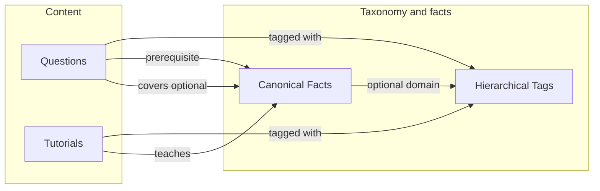

<!--
DOC STRUCTURE RULES
- Exactly one H1 (#) heading at the top
- All other headings must be ## or deeper
- Do NOT hard-code section numbers
- Do NOT put title in YAML header (Quarto uses first H1)
-->
# SPEC: Hierarchical tags and canonical facts (v0.0.8)

This spec defines the **design and storage approach** for **hierarchical tags** (to disambiguate terminology across domains and organize content) and **canonical facts** (to map questions and tutorial content via a shared database of normalized facts). It also specifies **minimal tutorial content** storage and **AI-assisted duplicate detection** for tags and facts. The system must support **filesystem persistence** for tags and facts so that editors and content creators can work in the filesystem or via the UI (see [PRD-0.0.1-v003.qmd](PRD-0.0.1-v003.qmd) system goals). Design targets **scalability** on the order of hundreds of thousands of facts and thousands of tags (not "Google" scale, but internet-scale growth).

**References:** [SPEC-0.0.6-QUESTION-TAGS-AND-BROWSE.qmd](SPEC-0.0.6-QUESTION-TAGS-AND-BROWSE.qmd), [QUESTION-FORMAT-0.0.1.qmd](QUESTION-FORMAT-0.0.1.qmd), [PRD-0.0.1-v003.qmd](PRD-0.0.1-v003.qmd), [SPEC-DB-FS-QUESTION-SYNC-0.0.3.qmd](SPEC-DB-FS-QUESTION-SYNC-0.0.3.qmd), [DOC-GUIDE-v001.qmd](DOC-GUIDE-v001.qmd).

---

## Purpose and scope

### Goals

- **Hierarchical tags:** Allow the same term to mean different things in different contexts (e.g. "if" in Python vs Bash). Support organization and discovery of questions and tutorial content by scoped tags (e.g. `programming/python/if`). Persist tags on the filesystem and in the database.
- **Canonical facts:** Maintain a single normalized representation of each fact so that tutorial content and questions can be linked to the same fact regardless of wording. Support "this question requires these facts" (prerequisites) and "this tutorial teaches these facts" (coverage). Persist facts on the filesystem and in the database.
- **Tutorial content (minimal):** Support minimal tutorial content entities that can be stored in several ways (direct content, pointer only, pointer + full copy, pointer + excerpt) and linked to facts and tags.
- **Duplicate reduction:** Use AI-assisted workflows so that when new tags or facts are proposed (or facts modified), potential duplicates are surfaced and the human editor must converse with the AI before proceeding; overrides are logged for administrator review; merge functionality preserves full history.

### Scope of this spec

- **In scope:** Data model and storage for hierarchical tags and canonical facts; filesystem layout and sync for both; scalability considerations; choice of tag path separator; AI-assisted duplicate detection and merge workflow; minimal tutorial content storage modes; link tables for questions and tutorials; UI preference for search over raw IDs.
- **Out of scope:** Full tutorial authoring workflows; extraction of facts from free text (assume facts are created/curated); detailed AI prompt design for duplicate detection (only the workflow and storage of conversations are specified).

### Backwards compatibility

There is **no** requirement for backwards compatibility. The system has not gone live; flat tags from SPEC-0.0.6 can be **replaced** by hierarchical tag references (tag IDs or stable path strings). Migration of existing data is a one-time implementation task.

---

## Scalability

Design for:

- **Facts:** Hundreds of thousands of rows (e.g. 100k–500k+). Use indexes on `canonical_text` (or full-text search), `tag_path`/domain, and any foreign keys. Consider partitioning by domain or tag_path if needed at scale.
- **Tags:** Thousands of nodes (e.g. 1k–10k+). Adjacency list with indexed `parent_id` and optional materialized path; recursive CTEs are acceptable at this scale. Index path or path prefix for filter-by-path queries.
- **Link tables** (question–fact, tutorial–fact, etc.): Row counts will be large (questions × facts per question, etc.). Index by content id and by fact_id for both directions of lookup. No need to design for billions of rows in v0.0.8; hundreds of thousands of link rows are the target.

---

## Hierarchical tags

### Problem

Many domains reuse the same terminology (e.g. "if" in Python vs Bash; "call" in finance vs telephony). A hierarchical tag system supports disambiguation and a consistent way to refer to scoped concepts (e.g. "if in the Python language").

### Tag path separator

Two options were considered:

| Separator | Example | Pros | Cons |
|-----------|---------|------|------|
| **`/`** | `programming/python/if`, `python/control-flow` | Standard for hierarchical paths (URLs, taxonomies); allows hyphen in segment names (e.g. `control-flow`). | Could be confused with filesystem paths in documentation—but the logical path is independent of how tags are stored on disk. |
| **`-`** | `python-if`, `python-control-flow` | No slash/directory confusion. | Ambiguous: is `python-control-flow` two segments or one? Hard to extend to deeper hierarchy (e.g. `programming-python-control-flow-if` is unwieldy). |

**Recommendation: use `/`** as the path separator. It is the conventional choice for hierarchies, allows hyphens inside segment names (`programming/python/control-flow`), and scales to arbitrary depth. How tags are stored on the filesystem (e.g. in directories or in a single file) is an implementation detail and should not dictate the logical separator.

**Convention:** Path format is `domain/subdomain/.../term` (e.g. `programming/python/if`, `programming/html/elements/paired`). A small set of top-level domains (e.g. programming, finance, telephony) helps avoid proliferation of equivalent paths.

### Storage options

| Approach | Description | Pros | Cons |
|----------|-------------|------|------|
| **Adjacency list** | Table with `id`, `name`, `parent_id` (self-referential). | Simple; cheap inserts and moves; works well with recursive CTEs in Postgres. | Descendant/ancestor queries need recursion (CTE). |
| **Materialized path** | Store full path as string or array (e.g. `programming/python/if`). | Fast prefix matching; good for display and filter-by-path. | Can be derived from adjacency list or stored redundantly. |
| **Closure table** | Separate table (ancestor, descendant, depth). | Very fast ancestor/descendant queries. | More rows; more complex writes. |

**Recommendation:** Use **adjacency list** as primary storage; store or compute a **normalized path** (with `/`) for display and prefix filtering. Index the path (or path prefix) for scalable filter queries. Treat the taxonomy as curated (admin/maintainer-defined) so path conventions stay consistent.

### Filesystem persistence for tags

Tags must be persistable on the **filesystem** so that editors can create and edit them outside the UI (see system goals in [PRD-0.0.1-v003.qmd](PRD-0.0.1-v003.qmd)).

- **Layout:** Define a tags root (e.g. `tags/`). Options: (a) one file per tag (e.g. `tags/{path-with-slashes-replaced}.yaml` or a directory tree `tags/programming/python/if.yaml`), or (b) a single or few YAML files that list the taxonomy (e.g. `tags/taxonomy.yaml` with a tree structure). The exact layout is an implementation choice; the spec requires that tags can be read from and written to the filesystem and synced with the database (same dual-write/sync philosophy as questions in [SPEC-DB-FS-QUESTION-SYNC-0.0.3.qmd](SPEC-DB-FS-QUESTION-SYNC-0.0.3.qmd)).
- **Sync:** Database remains source of truth for listing and filtering; filesystem is a mirror. FS-only tags can be imported; conflict resolution (DB wins vs FS wins) should follow the same pattern as question sync. Tag references on questions (and tutorials) are stored as tag IDs or stable path strings; when syncing from FS, path strings can be resolved to tag IDs using the taxonomy.

### Relation to existing flat tags

Replace flat `tags: string[]` (SPEC-0.0.6) with **hierarchical tag references** only: store tag IDs or stable path strings (e.g. `programming/python/if`) on questions. No backwards compatibility; migrate existing flat tag values to the new taxonomy as part of implementation.

### Use cases

- Organize and filter questions and tutorial content by hierarchical tag or path.
- Support "map question to tutorials" by shared tag path.
- Scope facts by domain (tag path) for filtering.

---

## Canonical facts

### Purpose

A single fact can be expressed in many ways. A **canonical fact** is one normalized representation, stored once. Tutorial content and questions link to it by ID; a future process (manual or AI) can match free text to fact IDs.

Example canonical statements:

- "In HTML, a 'container or paired' element must start with a &lt;start&gt; tag and end with a &lt;/end&gt; tag (same name)."
- "In HTML the 'h1' element is a paired element."
- "In HTML, the 'h1' element is used to delineate a 1st level heading."

### Storage approach

**Facts table**

- **id:** Stable identifier (e.g. UUID).
- **canonical_text:** The fact in normalized form (required).
- **tag_path (optional):** For organization and filtering (e.g. `programming/html`).
- **created_at / updated_at:** Timestamps.

Indexes: on `tag_path` (or domain), and full-text or search index on `canonical_text` for scalable search (see UI section below).

**Structured fields (optional): subject, predicate, object**

For a minimal **knowledge-graph style**, facts can optionally store a triple (subject, predicate, object) in addition to or instead of free-form `canonical_text`. This supports:

- **Structured querying:** e.g. "all facts where subject = 'h1 element' and predicate = 'is a'".
- **Consistency:** Same predicate vocabulary (e.g. "is a", "used for", "requires") across facts.
- **Interop:** Export or reason over facts as a small graph.

**Examples of structured representation:**

| canonical_text (human-readable) | subject | predicate | object |
|--------------------------------|---------|-----------|--------|
| In HTML, the 'h1' element is a paired element. | HTML h1 element | is a | paired element |
| In HTML, the 'h1' element is used to delineate a 1st level heading. | HTML h1 element | used to delineate | 1st level heading |
| In HTML, the 'table' element is a paired element. | HTML table element | is a | paired element |
| In HTML, a paired element must start with an opening tag and end with a closing tag with the same name. | HTML paired element | must have | opening and closing tag with same name |

The system may store **both** `canonical_text` (for display and full-text search) and optional (subject, predicate, object) (for structured filter or graph use). If only one form is stored, `canonical_text` is the minimum. Implementation can add `subject`, `predicate`, `object` columns or a separate table; the spec does not mandate the schema for the optional triple.

**Link tables (many-to-many)**

- **question_prerequisite_facts(question_version_id, fact_id):** This question requires understanding this fact.
- **question_facts(question_version_id, fact_id):** Optional; this question exercises or reinforces this fact.
- **tutorial_facts(tutorial_id, fact_id):** This tutorial (or segment) teaches this fact. (See minimal tutorial content below.)

**Filesystem persistence for facts**

Facts must be persistable on the **filesystem** so that editors can create and edit them outside the UI.

- **Layout:** Define a facts root (e.g. `facts/`). Options: (a) one file per fact (e.g. `facts/{uuid}.yaml` or by path `facts/programming/html/h1-paired.yaml`), or (b) one or more YAML files listing facts (e.g. `facts/index.yaml` with an array or map). Each fact file (or entry) must include at least `id`, `canonical_text`, and optional `tag_path`, timestamps.
- **Sync:** Database is source of truth for listing and linking; filesystem is a mirror. FS-only facts can be imported; conflicts resolved per the same pattern as question sync.

---

## Minimal tutorial content

This version implements **minimal** tutorial content: a tutorial is a linkable entity that can reference external or internal content and can be tagged and linked to facts. Four storage modes are supported:

1. **Direct content only:** Tutorial content is stored entirely in the system—e.g. text, images, Word documents, or other files. No external pointer. Use case: original content authored and held only in yrS3.

2. **Pointer only:** Store only a **pointer** to external content (e.g. URL, ISBN/title/page/paragraph, reference to an academic paper). The system does not store the content itself. Use case: reference to a live web page or a book; no backup or excerpt in yrS3.

3. **Pointer + full document:** Store the pointer **and** a full copy of the source document in yrS3 (for backup and historical preservation). Use case: external source may disappear; we preserve a snapshot.

4. **Pointer + excerpt:** Store the pointer **and** only the **excerpt** from the document that contains the relevant fact (or more context). Use case: cite a specific passage; avoid storing the entire document while keeping the cited portion in yrS3.

Implementation must support these four modes (e.g. tutorial record has: optional external reference, optional stored content type [full document vs excerpt], optional binary or text content). Tutorials can be linked to facts (teaches) and to hierarchical tags. Tutorial content is persistable on the filesystem in line with system goals; exact layout (e.g. `tutorials/{id}/meta.yaml` plus optional `content.*` or `excerpt.*`) is an implementation detail.

---

## AI-assisted duplicate detection and merge

### Goals

- Reduce duplicate tags (e.g. "programming/python/if" vs "python/control-statements/if" or similar).
- Reduce duplicate or near-duplicate canonical facts when adding or modifying facts.
- Human has final say; AI supports the decision and logs overrides for administrator review.

### Workflow (tags and facts)

When a user **proposes a new tag** (or a new fact, or a modification to an existing fact):

1. **Search:** The system (using AI and/or full-text/similarity search) searches existing tags (or facts). If one or more potential duplicates are found, the user is **not** allowed to proceed without a conversation.
2. **Conversation:** The human must **converse with the AI** about the merits of adding the new tag (or fact) vs using an existing one. The AI presents the potential duplicate(s) and reasoning; the human may argue for a new tag (e.g. different meaning, different scope). The AI may rebut. This exchange continues until the human makes a decision.
3. **Decision:** The human decides: (a) use an existing tag/fact (abandon or merge), or (b) create the new tag/fact anyway.
4. **Override logging:** If the AI has flagged a likely duplicate and the human **nevertheless** creates the new tag/fact (override), the system **allows** the action but:
   - **Logs** the event for an administrator (e.g. in a dedicated table or log store).
   - Stores the **AI summary** of why it considered this a duplicate, and the **human's rebuttal** (the human is shown the AI's complaints and is asked to provide a response).
   - The full **conversation** (AI and human messages) is stored in the filesystem and/or database so that an administrator can review the full exchange.
   - The human is **informed** that this override will be logged and that an administrator may review it.

If no potential duplicate is found, the user may create the tag/fact without this workflow (normal create path).

### Merge

When duplicates are **identified** (e.g. by an admin or by the same AI-assisted flow):

- **Merge functionality:** The system must support **merging** two (or more) tags into one, and two (or more) facts into one. All references (questions, tutorials, link tables) are updated to point to the surviving tag/fact.
- **History:** The entire history of the merge (which tag/fact was merged into which, when, by whom) must be **stored and recoverable**. Merged-away tags/facts are retained in a "merged" or historical state so that old references can be resolved and audits are possible (soft delete or history table).

Storage for conversations and override logs may be in the database, the filesystem, or both; the spec requires that the data be persistable and reviewable by an administrator.

---

## UI: search over IDs

All UIs that involve **tags** or **facts** should favor **natural language and search** over raw IDs:

- **Search for a tag:** At minimum, provide a **full-text or path-prefix search** over tag names and paths. The user types (e.g. "python if" or "programming/python") and sees matching tags; selection is by click or choose from list, not by typing a UUID.
- **Search for a fact:** At minimum, provide **full-text search** over `canonical_text` (and optional subject/predicate/object). The user types a phrase and sees matching facts; selection by click or choose from list. Additional filters (e.g. by tag path, by subject) may be added for power users.

Users should not be required to memorize or paste UUIDs or internal IDs when attaching tags or facts to questions or tutorials.

---

## How the two concepts relate

- **Tags** organize and discover content (questions, tutorials, and optionally facts by domain).
- **Facts** connect questions (prerequisites, optional "covers") and tutorials ("teaches") to a shared canonical knowledge base. Mapping "question → tutorials" works by: question → prerequisite facts → tutorials that teach those facts (optionally filtered by tag).

Diagram (content and taxonomy):

---

## Out of scope (explicit)

- Full tutorial authoring workflows (only minimal storage and linking).
- Automatic extraction of facts from free text (facts are created/curated; matching free text to fact IDs is a future feature).
- Detailed AI prompt design for duplicate detection (workflow and storage of conversations/overrides are in scope; prompt engineering is not specified here).

---

## Suggested implementation order

- **Phase 1:** Hierarchical tag taxonomy: DB table(s), path convention with `/`, filesystem layout and sync; replace flat tags on questions with tag path or tag ID references.
- **Phase 2:** Canonical facts table and question–fact link tables; filesystem layout and sync for facts; optional subject/predicate/object.
- **Phase 3:** Minimal tutorial content: tutorial entity, four storage modes, tutorial–fact and tutorial–tag links; filesystem persistence for tutorials.
- **Phase 4:** AI-assisted duplicate detection: search on propose, conversation UI, override logging, conversation and rebuttal storage; merge with full history.

---

## Summary

- **Scalability:** Design for hundreds of thousands of facts and thousands of tags; index and optional partitioning as needed.
- **Filesystem:** Tags and facts are persistable on the filesystem and synced with the database; same dual-write/sync philosophy as questions.
- **Separator:** Use `/` for hierarchical tag paths (e.g. `programming/python/if`); path convention and curated taxonomy.
- **No backwards compatibility:** Replace flat tags with hierarchical references.
- **Facts:** Canonical text required; optional subject/predicate/object for knowledge-graph style; link tables for questions and tutorials.
- **Minimal tutorials:** Four modes—direct content, pointer only, pointer + full doc, pointer + excerpt; link to facts and tags.
- **AI duplicate workflow:** Search on propose, mandatory conversation when duplicate suspected, human decides; override logged with AI summary and human rebuttal; full conversation stored; merge with full history.
- **UI:** Full-text (and optional structured) search for tags and facts; no requirement to use raw UUIDs.
