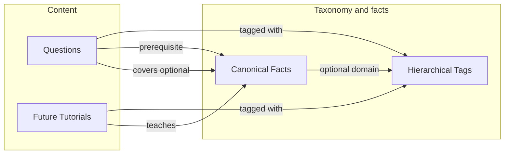

<!--
DOC STRUCTURE RULES
- Exactly one H1 (#) heading at the top
- All other headings must be ## or deeper
- Do NOT hard-code section numbers
- Do NOT put title in YAML header (Quarto uses first H1)
-->
# SPEC: Hierarchical tags and canonical facts (v0.0.8)

This spec defines a **design and storage approach** for two related concepts: **hierarchical tags** (to disambiguate terminology across domains and organize content) and **canonical facts** (to map questions and tutorial content via a shared database of normalized facts). The goal is to support mapping questions to tutorial content and to prerequisite knowledge for test questions. This document covers **storage and data model only**; extraction of facts from text, AI-based matching, and search implementation are out of scope and deferred.

**References:** [SPEC-0.0.6-QUESTION-TAGS-AND-BROWSE.qmd](SPEC-0.0.6-QUESTION-TAGS-AND-BROWSE.qmd), [QUESTION-FORMAT-0.0.1.qmd](QUESTION-FORMAT-0.0.1.qmd), [PRD-0.0.1-v003.qmd](PRD-0.0.1-v003.qmd), [DOC-GUIDE-v001.qmd](DOC-GUIDE-v001.qmd).

---

## Purpose and scope

### Goals

- **Hierarchical tags:** Allow the same term to mean different things in different contexts (e.g. "if" in Python vs Bash vs general programming). Support organization and discovery of questions and (future) tutorial content by scoped tags (e.g. "python-if" or "programming/python/if").
- **Canonical facts:** Maintain a database of facts in normalized form so that tutorial content and questions can be linked to the same fact regardless of how it is worded in the source. Support "this question requires these facts" (prerequisites) and "this tutorial teaches these facts" (coverage), enabling mapping from questions to relevant tutorials.

### Scope of this spec

- **In scope:** Data model and storage design for hierarchical tags and canonical facts; link tables for questions (and placeholder for future tutorial content); how the two concepts relate.
- **Out of scope:** Extracting facts from text or tutorials; AI or similarity-based matching of free text to canonical facts; full-text or semantic search over facts; full tutorial content model and authoring (only placeholder/stub for links).

---

## Hierarchical tags

### Problem

Many domains reuse the same terminology. For example:

- "if" can mean a conditional statement in Python, Bash, or another language, each with different syntax or semantics.
- "call" means something different in finance vs telephony.

Without structure, authors might create inconsistent tag forms: "python-if", "python-conditionals-if", "programming-python-if". A hierarchical tag system should support disambiguation and a consistent way to refer to scoped concepts (e.g. "if in the Python language").

### Storage options

| Approach | Description | Pros | Cons |
|----------|-------------|------|------|
| **Adjacency list** | Table with `id`, `name`, `parent_id` (self-referential). | Simple; cheap inserts and moves; works well with recursive CTEs in Postgres for path and ancestor queries. | Descendant/ancestor queries need recursion (CTE). |
| **Materialized path** | Store full path as string or array (e.g. `programming/python/if`). | Fast prefix matching and human-readable paths; good for display and filter-by-path. | Can be derived from adjacency list or stored redundantly; path format must be standardized. |
| **Closure table** | Separate table with (ancestor, descendant, depth). | Very fast ancestor/descendant queries. | More rows; more complex writes. |

### Recommendation

- Use an **adjacency list** as the primary storage: a **tag taxonomy** table with `id`, `name`, `parent_id`. Use **recursive CTEs** in Postgres to compute paths and ancestors when needed.
- Optionally store or compute a **normalized path** (e.g. `programming/python/if`) for display and for "filter by path prefix." Path format should follow a **convention** (e.g. `domain/subdomain/term`) and a small set of top-level domains (e.g. programming, finance, telephony) to avoid proliferation of forms like "python-if" vs "programming-python-if."
- Treat the taxonomy as **curated** (admin- or maintainer-defined) rather than fully user-defined, so that path conventions stay consistent.
- On questions (and future tutorial content), store **references** to tags: either tag IDs or stable path strings. Filtering "questions with tag X" then means "questions that reference this tag (or a descendant)."

### Relation to existing flat tags

The current system ([SPEC-0.0.6](SPEC-0.0.6-QUESTION-TAGS-AND-BROWSE.qmd)) uses **flat** `tags: string[]` in question meta and in `question_versions.tags`. Options for evolution:

- **Replace:** Migrate to hierarchical tag references only (tag IDs or paths). Requires migration of existing tag values to the new taxonomy.
- **Extend:** Add an optional field (e.g. `tag_paths: string[]` or `tag_ids: uuid[]`) alongside flat `tags` for backward compatibility; gradually move to hierarchical references.

Choice can be made at implementation time based on migration cost and whether flat tags remain useful for simple filters.

### Use cases

- Organize and filter questions (and later tutorial content) by hierarchical tag or path.
- Support "map question to tutorials" by shared tag path (e.g. both question and tutorial tagged with "programming/python/if").
- Disambiguate concepts when attaching tags to facts (e.g. fact domain = "programming/html").

---

## Canonical facts

### Purpose

A single fact can be expressed in many ways. For example, these all express related ideas:

- "In HTML, a 'container or paired' element must start with a &lt;start&gt; tag and end with a &lt;/end&gt; tag (same name)."
- "In HTML the 'h1' element is a paired element."
- "In HTML, the 'h1' element is used to delineate a 1st level heading."
- "In HTML the 'table' element is a paired element."

A **canonical fact** is one normalized representation of such a fact, stored once. Tutorial content and questions can then be **linked** to that canonical fact by ID, even when the source text uses different wording. A future process (manual or AI) can match free text to fact IDs; this spec does not define that process.

### Storage approach

**Facts table**

- **id:** Stable identifier (e.g. UUID).
- **canonical_text:** The fact in normalized form (e.g. one of the statements above, or a standardized phrasing).
- **domain / tag_path (optional):** For organization and filtering (e.g. link to hierarchical tag or store path string).
- **created_at / updated_at:** Timestamps.

Optionally add structured fields (e.g. subject, predicate, object) for a minimal knowledge-graph style; for many use cases, canonical text plus optional domain is enough.

**Link tables (many-to-many)**

- **Question–fact (prerequisites):** e.g. `question_prerequisite_facts(question_version_id, fact_id)`. Meaning: "This question requires understanding this fact." Enables "which facts must a learner know to answer this question?"
- **Question–fact (covers):** Optionally `question_facts(question_version_id, fact_id)` for "this question exercises or reinforces this fact." Supports coverage reporting.
- **Tutorial–fact:** When tutorial content exists: e.g. `tutorial_segment_facts(tutorial_id, segment_ref, fact_id)` or `tutorial_facts(tutorial_id, fact_id)`. Meaning: "This tutorial (or segment) teaches this fact." Enables "which tutorials cover the prerequisites for this question?"

**Content entities**

- **Questions** already exist (`question_versions`). Link tables above use `question_version_id` (or equivalent).
- **Tutorial content** is not in the system yet. The spec defines **placeholder** entities (e.g. a future `tutorials` table and optionally `tutorial_segments`) so that the fact link schema can reference them when implemented. No tutorial tables are created in this spec; only the fact and question–fact tables are in scope for implementation.

### Recommendation

- Implement a **facts** table with `id`, `canonical_text`, optional `tag_path` or `domain`, and timestamps.
- Implement **question_prerequisite_facts** (and optionally question "covers" links) so questions can declare prerequisite facts.
- Design tutorial–fact link schema (e.g. `tutorial_facts(tutorial_id, fact_id)`) so it can be added when tutorials are introduced; do not create tutorial tables in this phase.
- Assume fact IDs are assigned by a future process (manual curation or AI extraction + matching); this spec does not define extraction or similarity search.

---

## How the two concepts relate

- **Tags** are for **organization and discovery:** filter and browse questions (and tutorials) by topic. They can attach to questions, to tutorial content, and optionally to facts (e.g. to scope a fact to "programming/html").
- **Facts** are for **prerequisite and coverage mapping:** "this question requires these facts" and "this tutorial teaches these facts." Linking both to the same canonical fact enables mapping from a question to tutorials that teach the required knowledge.

Both tags and facts can attach to questions. When tutorials exist, both can attach to tutorials. Facts can optionally be scoped by tag (domain) for filtering. The main flow for "map question to tutorial" is: question → prerequisite facts → tutorials that teach those facts (and optionally same tag path).

---

## Out of scope (explicit)

- **Extracting** facts from tutorial or question text.
- **AI or similarity-based matching** of free text to canonical fact IDs.
- **Search/indexing** implementation for fact or tag search (e.g. full-text or semantic).
- **Full tutorial content model** and authoring; only placeholder/stub for tutorial–fact and tutorial–tag links when tutorials are added.

---

## Suggested implementation order

- **Phase 1:** Hierarchical tag taxonomy: table(s) for tags (adjacency list), optional path derivation; API or migration path from flat tags to tag references on questions.
- **Phase 2:** Canonical facts table and question–fact link tables (prerequisites, and optionally "covers"); no tutorial tables yet.
- **Phase 3:** When tutorial content is introduced: tutorial tables, tutorial–fact and tutorial–tag links; reuse same tag taxonomy and facts database.

---

## Summary

- **Hierarchical tags** are stored in an adjacency-list taxonomy with optional materialized path; questions (and later tutorials) reference tags for organization and disambiguation. A single convention for path form avoids inconsistent tag names.
- **Canonical facts** are stored in a facts table with canonical text and optional domain; question–fact link tables support prerequisites (and optionally coverage). Tutorial–fact links are designed for but not implemented until tutorial content exists.
- **Relationship:** Tags organize content; facts connect questions to prerequisite knowledge and (via future tutorial–fact links) to tutorials that teach that knowledge. This spec covers storage and data model only; extraction and matching are deferred.
